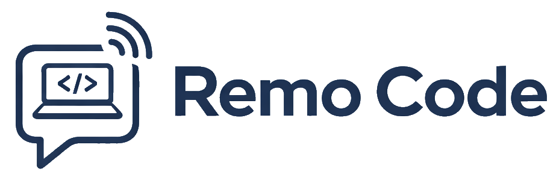

<p align="center">
  
</p>

<h3 align="center">Chat with Claude Code from any browser or phone</h3>

<p align="center">Full activity streaming — thinking, tool calls, and responses in real-time. Self-hosted, open-source.</p>

<p align="center">
  <a href="#quick-start">Quick Start</a> &bull;
  <a href="#why-remo-code">Why Remo Code</a> &bull;
  <a href="#architecture">Architecture</a> &bull;
  <a href="#production-deployment">Deploy</a>
</p>

---

## Why Remo Code?

**[OpenClaw](https://openclaw.ai/)** popularized the idea of talking to an AI agent from your phone. But it requires you to trust a third-party runtime with shell access to your machine, and [security researchers have already found real data exfiltration in community-contributed OpenClaw skills](https://medium.com/@cognidownunder/claude-code-remote-control-vs-openclaw-one-is-secure-and-the-other-is-a-liability-3cd936cc58b3).

**Remo Code** gives you the same "chat with your agent from anywhere" workflow, but with full activity streaming and complete control:

| | OpenClaw | Claude Code Remote Control | **Remo Code** |
|---|---|---|---|
| Self-hosted | Partial (local agent, cloud relay) | No (Anthropic relay) | **Yes, fully** |
| Open source | Yes | No | **Yes (MIT)** |
| Activity streaming | No | No | **Yes (thinking, tool calls, text)** |
| Web UI | No (messaging apps only) | Yes (claude.ai) | **Yes (your own domain)** |
| Multi-session | No | No | **Yes** |
| File attachments | No | No | **Yes (images + text files)** |
| Auth & data storage | Third-party servers | Anthropic servers | **Your Supabase instance** |

### Who is this for?

- **Developers** who want to check on long-running Claude Code tasks from their phone
- **Teams** who want a shared dashboard for multiple Claude Code sessions
- **Security-conscious users** who don't want third-party tools with shell access to their machines
- **Self-hosters** who want full control over their data and infrastructure

## Quick Start

### Prerequisites

- [Bun](https://bun.sh) runtime
- [Claude Code](https://claude.ai/code) CLI installed
- A [Supabase](https://supabase.com/) project (free tier works)

### 1. Clone and install

```bash
git clone https://github.com/finedesignz/remo-code.git
cd remo-code
bun install
```

### 2. Configure Supabase

Create a Supabase project and run the migrations in `supabase/migrations/` via the SQL Editor.

### 3. Set environment variables

```bash
cp hub/.env.example hub/.env
# Edit: SUPABASE_URL, SUPABASE_ANON_KEY, SUPABASE_SERVICE_ROLE_KEY, HUB_ALLOWED_ORIGINS

cp web/.env.example web/.env
# Edit: VITE_SUPABASE_URL, VITE_SUPABASE_ANON_KEY, VITE_HUB_URL
```

### 4. Start the servers

```bash
# Terminal 1 — Hub server (port 3040)
bun run dev:hub

# Terminal 2 — Web dev server (port 5173)
bun run dev:web
```

### 5. Create your account

Open `http://localhost:5173` and create your account on the setup form.

### 6. Connect Claude Code

Generate an API key in Settings, then run the agent in your project directory:

```bash
npx remo-code-agent --api-key YOUR_API_KEY --local-output
```

That's it. The agent spawns a Claude Code process, and everything streams to your browser in real-time — thinking, tool calls, file edits, and responses. You get both terminal output and web UI.

**Each agent = one Claude Code session.** To connect multiple projects, run the agent in each project directory. Each gets its own session in the web UI. Sessions auto-resume by project directory.

### Set up a shell alias (recommended)

Add an alias so you can run `claude-remote` instead of the full command:

<details>
<summary><b>Windows (PowerShell)</b></summary>

Add to your PowerShell profile (`$PROFILE`):
```powershell
# Open profile in editor (creates it if it doesn't exist)
if (!(Test-Path $PROFILE)) { New-Item -Path $PROFILE -Force }
notepad $PROFILE
```

Add this line:
```powershell
function claude-remote { npx remo-code-agent --api-key YOUR_API_KEY --local-output }
```

Reload: `. $PROFILE` or open a new terminal.
</details>

<details>
<summary><b>macOS / Linux (bash)</b></summary>

Add to `~/.bashrc` (or `~/.bash_profile` on macOS):
```bash
alias claude-remote='npx remo-code-agent --api-key YOUR_API_KEY --local-output'
```

Reload: `source ~/.bashrc`
</details>

<details>
<summary><b>macOS / Linux (zsh)</b></summary>

Add to `~/.zshrc`:
```bash
alias claude-remote='npx remo-code-agent --api-key YOUR_API_KEY --local-output'
```

Reload: `source ~/.zshrc`
</details>

<details>
<summary><b>fish</b></summary>

Add to `~/.config/fish/config.fish`:
```fish
alias claude-remote 'npx remo-code-agent --api-key YOUR_API_KEY --local-output'
```

Reload: `source ~/.config/fish/config.fish`
</details>

Then just run `claude-remote` in any project directory — same as running `claude` but with remote streaming to the web UI.

### Using the hosted version

If you don't want to self-host, use the hosted hub at [app.remo-code.com](https://app.remo-code.com):

```bash
npx remo-code-agent --api-key YOUR_API_KEY --local-output
```

The default hub URL is `https://app.remo-code.com` — no `--hub-url` needed.

## Architecture

```
Browser (React SPA)
    ↕ WebSocket + REST API
Hub Server (Bun + Hono)
    ↕ WebSocket
Local Agent (one per project)
    ↕ subprocess stdin/stdout (stream-json)
Claude Code CLI
```

Four packages in a Bun workspace:

- **hub/** — Bun + Hono server handling auth (Supabase JWT), message relay, and session management. Broadcasts Claude's activity events (thinking, tool use, text) to subscribed browsers.
- **web/** — React 19 + Vite + Tailwind CSS 4 chat UI with activity feed, session switching, file attachments, light/dark theme, and unread badges.
- **agent/** — Local streaming agent that runs on your dev machine. Spawns a persistent Claude Code CLI process with `--input-format stream-json --output-format stream-json`, parses events, and relays to the hub. Published as [`remo-code-agent`](https://www.npmjs.com/package/remo-code-agent) on npm.
- **channel/** — (Legacy) Claude Code channel plugin. Kept for backward compatibility.

## How It Works

1. You run `npx remo-code-agent --api-key xxx` in your project directory
2. The agent connects to the hub via WebSocket and registers a session
3. The agent spawns `claude --input-format stream-json --output-format stream-json --verbose`
4. When you send a message in the web UI, the hub forwards it to the agent
5. The agent writes the message to Claude's stdin as JSON
6. Claude responds — thinking, tool calls, text stream out via stdout
7. The agent parses the stream-json events and relays them to the hub
8. The hub broadcasts to all subscribed browsers in real-time

**Session resume:** The agent reuses existing sessions by matching the project directory. Restart the agent and it reconnects to the same session with full message history.

**Conversation memory:** The agent keeps a single persistent Claude process — full conversation context is maintained across messages, just like the terminal.

## Features

- **Activity streaming** — see Claude's thinking, tool calls, and text responses in real-time
- **File attachments** — paste images (Ctrl+V) or attach text files in the chat
- **Multi-session** — run agents in multiple project directories, switch between them
- **Session resume** — restart the agent and reconnect to the same session
- **Scheduled tasks** — fire prompts, skills, or supervisor commands on a cron cadence against one session, one supervisor, or all of either. Per-target run history, daily cost cap, offline-grace replay, and post-run actions (chain, email, telegram, web push, webhook). See [docs/scheduled-tasks.md](docs/scheduled-tasks.md).
- **Error capture** — Sentry-style intake at `/api/sentry/:project_id/envelope/` that fingerprints + dedupes + rate-limits + caps runtime errors from your deployed apps, then routes them as a structured `user_message` into the Claude session bound to that repo so Claude can investigate, fix, commit, and push in-session. Includes one-click Sentry SDK auto-install for Node+Express / Node+Next.js / Python+FastAPI / Python+Django (supervisor git-ops + Coolify env PATCH). See [docs/error-capture.md](docs/error-capture.md).
- **Grid View** — watch up to 12 Claude Code sessions side-by-side at `#/grid`. User-named tabs persist per account (`chat_tabs` + `chat_tab_sessions`), each with a layout mode (`3x3`, `4x3`, or `auto-fit`). One WebSocket subscribes to many sessions in one frame, message lists are virtualized, and streaming text is RAF-coalesced. On phones the grid auto-swaps to a single-pane accordion (only one chat mounted at a time). See [docs/grid-view.md](docs/grid-view.md). <!-- screenshot: docs/img/grid-view.png -->
- **Unread badges** — know when sessions have new messages
- **Light/dark theme** — toggle in the header
- **Mobile-first** — responsive design with safe-area support for notched devices

## Production Deployment

Build and deploy with Docker:

```bash
docker build -t remo-code .
docker run -p 3040:3040 \
  -e SUPABASE_URL=... \
  -e SUPABASE_ANON_KEY=... \
  -e SUPABASE_SERVICE_ROLE_KEY=... \
  -e HUB_ALLOWED_ORIGINS=https://your-domain.com \
  remo-code
```

The Docker image builds the web frontend and serves it from the hub — one container, one port. The agent runs on your dev machine, not on the server.

## Project Structure

```
├── hub/                # Bun + Hono server (HTTP, WebSocket, auth)
│   └── src/
│       ├── api/        # REST endpoints (sessions, messages, profile, setup)
│       ├── auth/       # JWT + API key verification middleware
│       ├── db/         # Supabase clients and data access layer
│       ├── middleware/  # Rate limiting
│       ├── utils/      # Shared utilities (token generation)
│       └── ws/         # WebSocket handlers (agent, channel, client) + Zod schemas
├── web/                # React 19 + Vite + Tailwind CSS 4 SPA
│   └── src/
│       ├── components/ # Layout, ChatPanel, ActivityFeed, Sidebar, etc.
│       └── hooks/      # useAuth, useWebSocket, useSessions, useChat, useActivity
├── agent/              # Local streaming agent (npm: remo-code-agent)
│   └── src/
│       ├── index.ts    # Entry point — wires hub client, Claude runner
│       ├── claude-runner.ts  # Persistent Claude CLI process management
│       ├── hub-client.ts     # WebSocket client to hub
│       └── config.ts         # Config loading (CLI args, env vars, config file)
├── channel/            # (Legacy) Claude Code channel plugin
├── supabase/           # Database migrations
└── Dockerfile          # Multi-stage production build
```

## Security

- **Supabase JWT auth** on all API and WebSocket endpoints
- **Row-Level Security** on all database tables — multi-tenant by default
- **API keys** stored as SHA-256 hashes with timing-safe comparison
- **CSP, HSTS, and security headers** on all responses
- **Rate limiting** on API routes, setup endpoints, and WebSocket messages
- **Per-IP connection limits** on WebSocket endpoints
- **Path traversal protection** on static file serving
- **Non-root Docker user** in production
- **Setup endpoint mutex** preventing race conditions

Your data stays in your Supabase instance. Your Claude Code sessions stay on your machine. The hub is just a relay — and you own it.

## License

Apache-2.0
